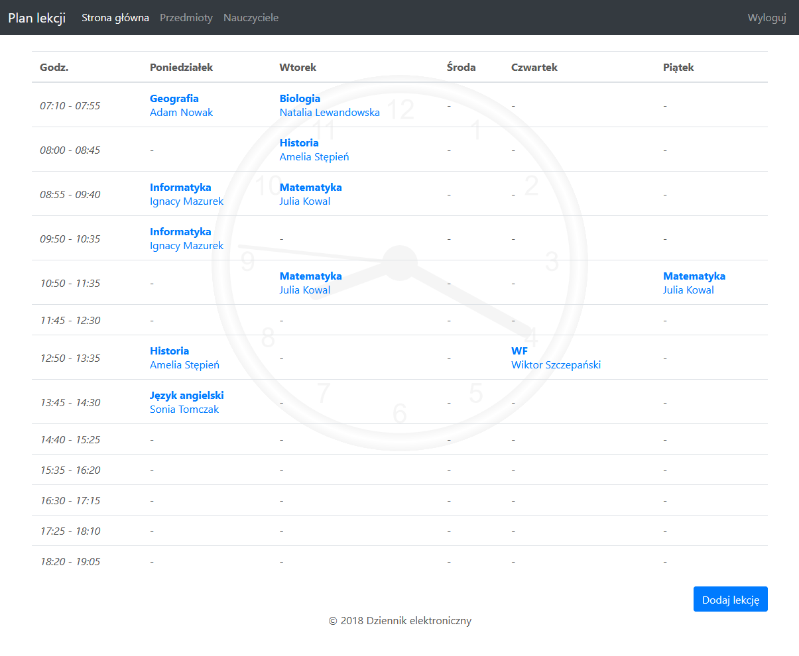

Electronic lesson planner, created using PHP.

To run this you need a local database (either MySQL or MariaDB) with 'dziennik' database and 'root' user with not password. You can import the database schema from 'dziennik.sql' file. In case that you would like to change it, you can do it manually in dbconfig.php.

Teacher login credentials:

```
login: nauczyciel
password: test
```

Student login credentials: 

```
login: uczen
password: test
```

